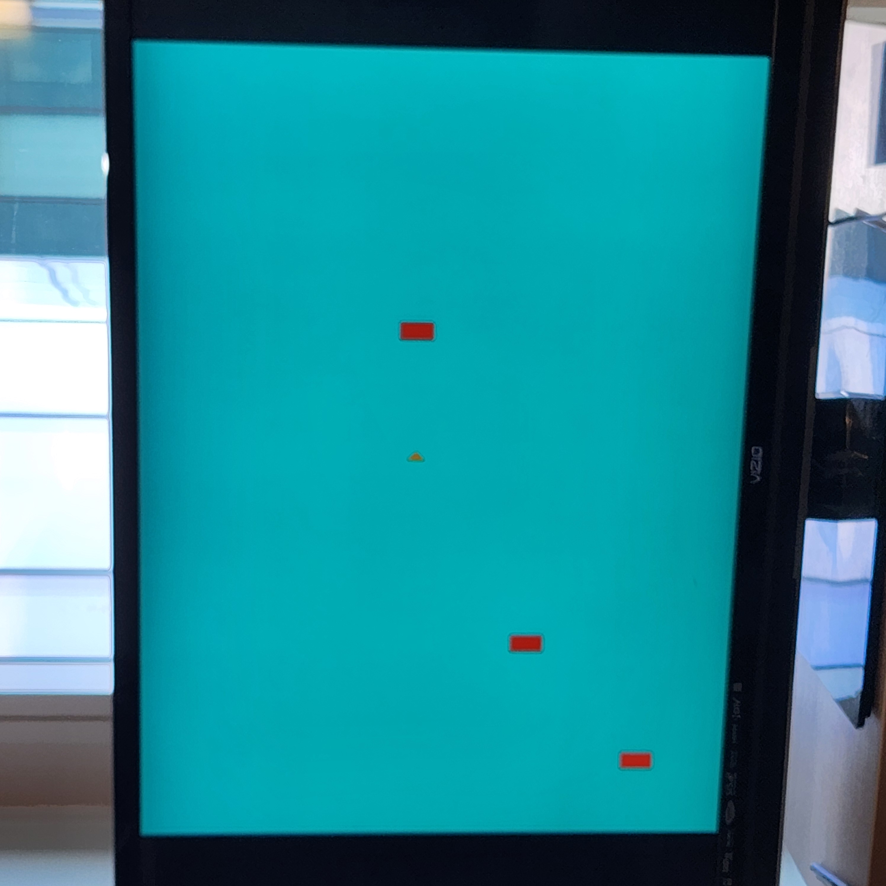
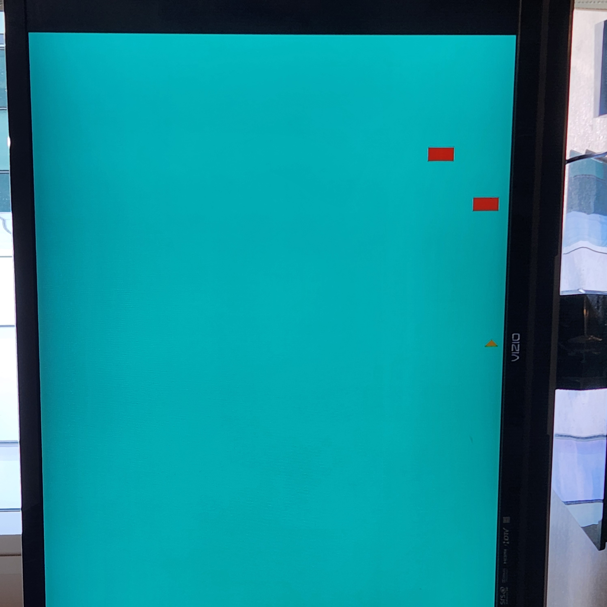
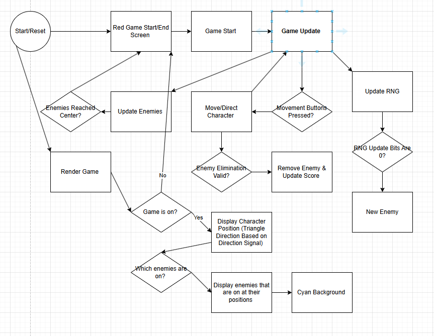
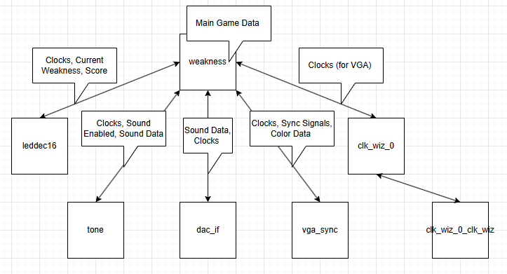

# Digital System Design Final Project: "Weakness" 
---
## Expected Behavior
In this custom video game titled "Weakness”, the player controls a triangular character that can use the directional buttons to move up and down and aim left or right (indicated by the direction the triangle is pointing), and the center button to eliminate an enemy or start the game if it is not currently running (indicated by the red screen). 
- Enemies appear on the sides of the screen in rows and attempt to reach the player in the center.
  
  - Notably, enemy generation is pseudo-random, controlled by a 48-bit LFSR (Linear-Feedback Shift Register) 
- The right 7-segment display (rightmost 4 digits) displays the number of successfully eliminated enemies. The left 7-segment display (leftmost 1 digit) displays the weakness number of the enemy the character is looking at.
  
- The character cannot eliminate an enemy unless exactly 1 of the switches is on (up). An enemy with a certain enemy number can only be destroyed by pressing the center button with that respective number switch on. 
- You lose when an enemy reaches the center of the screen, where the player is located, and the screen will turn red again.
  
- A square-wave sound is played through the DAC module every time an enemy is eliminated. A lower-pitch sound is played when the game ends due to an enemy reaching the center of the screen. 

---
## Attachments
- The Pmod I2S2 DAC module will play square-wave sound effects when the player successfully kills an enemy or when an enemy reaches the player when the game is over.
  - The module should be connected to Pmod port JA in the middle of the right side of the Nexys A7 board. 
- The female VGA connector will be connected to a display via a male VGA cable or the VGA to HDMI converter and will be used to output visuals of the player character and enemies.
  - Note: if the display supports audio, it is recommended to connect the DAC module output directly to the display's audio input, as the included DAC speaker is very quiet even at its maxiumu theoretical volume. 

---
## Vivado and Nexys Upload Instructions 
1. Create a new RTL project called *weakness* in Vivado
2. Download and import all `.vhd` source files from the GitHub page as source files to the project.
3. Download and import `weakness.xdc` as a constraints file to the project.
4. Choose Nexys A7-100T as the board utilized in the project. (Click 'Finish' afterwards) 
5. Run Synthesis
6. Run Implementation
7. Generate Bitstream
8. Open Hardware Manager, click Auto Connect, and Program Device followed by the device.
9. Ensure that all attachments and supplementary hardware, including the external display/speakers are on and functioning, and that they are properly connected to the device in accordance with the Attachments section.
10. The game should enter its initial state by displaying a red screen. 

---
### Inputs:
- All 5 Onboard Buttons
- All 16 Onboard Switches
- Onboard 100MHz Clock 
### Outputs:
- 7-Segment Display
  - Shows the Weakness value and the current score
- VGA Connector
  - Shows the game state, character and all enabled enemies
- DAC Module (Pmod Port JA)
  - Plays a square-wave tone when an enemy is eliminated and a lower-pitched tone when the player is eliminated and the game ends 
---
## Starting Code/Changes: 
No specific lab code was a direct "starting point," as we initially began writing the primary project file from scratch to avoid unnecessary overhead in development. However, the project is loosely based around some files (particularly drivers) from Labs 3 and 5 (bouncing ball and siren) as these provided the basic starter code necessary to generate signals to control the VGA display and the DAC. The `leddec16` file was also modified to serve as a driver for the specific data to be rendered on the 7-segment displays. The Pong lab was used to set up the `vga_sync`, `leddec16`, `clk_wiz_0`, and `clk_wiz_0_clk_wiz` for the VGA and 7-segment display. 
- `vga_sync.vhd` is a general-purpose driver providing rendering capabilities for the board's built-in VGA output.
  - Notably, this file was not directly modified, as this would compromise its functionality, but the way in which it is utilized was different from previous labs, as all 4 bits of each color (RGB) were utilized within the input in `weakness.vhd` for a more diverse palette (and to make the character orange)
- `clk_wiz_0.vhd` and `clk_wiz_0_clk_wiz.vhd` are used unmodified to provide the 25MHz clock required by the VGA driver to function, creating a signal called `pxl_clk` for this purpose.
- `leddec16.vhd` was modified to have a 20-bit (5-digit) input signal, and the last 3 digits of the left display were disabled, with the 5 digits of the input being mapped to the 5 remaining digits.

  - The purpose of this change was to allow the input signal to contain a concatenation of the weakness value (leftmost digit) and the score (right 4 digits) with a separation between them. 
Files from lab 5 `tone` and `dac_if` were reused to provide simple square-wave based sound effects.
- Notably, automated pitch modulation was unnecessary, so `wail.vhd` was omitted, and the data from `tone.vhd` was directly mapped through to the `dac_if.vhd` file.

  - The `index` signal was removed entirely, as there was no need to generate any ramp-like waveforms.
  - A new input `enabled` was added to force the waveform to take on a singular value (thus not making a wave) when this signal was '0'. 
- `dac_if.vhd` was unmodified, but notably, its inputs in `weakness.vhd` had to be modified to function with a 100MHz clock as opposed to a 50MHz clock, so the `count` values were offset by 1. 
Finally, the constraints file `weakness.xdc` was built from prior documentation of the Nexys board with inputs added and taken away based on what was required for the inputs and outputs.
It is notable that examples from these two labs were examined to give us an idea of how to properly interface with the driver files in question, but the majority of the game code itself is completely custom. 

## Development Process:
The project began with downloading and including the driver files within the project. After the game's logic design was decided, all of the inputs and outputs were known, so a `weakness.xdc` file was generated using the pin numbers from the inputs and outputs required for these functions on the board. 

The first pieces completed were the addition of the basic signals the game would require to function and the establishment of the modifications and instantiation of the `leddec16` driver, which would then be used to test the addition of features without developing the entire rendering pipeline first. 

The clock was added, as well as a count signal to function with the clock and allow for clock signal division for processes. This was useful for the update process, which was the primary location in which clock-based game events occurred. The first of these to be implemented was character movement, as well as character direction pointing. The game's start/game over state signal was also added here. 

The game's main feature was also added early in the process, with the switches being utilized as a single std_logic_vector to verify that the input state was valid (that only 1 switch was on or '1' at a time) to eliminate a corresponding enemy. 

The enemy management was then completed. A custom type `enemy_array` was added to manage several specific std_logic_vectors to store the enemies. 2 of these were instantiated to allow the two sides of the screen to contain enemies, and the character's "current facing enemy" was determined by utilizing a simple bit-shifting division trick to determine a range of vertical pixels the character position was in. This was greatly simplified by the fact that only 10 specifically defined rows of enemies were generated, so the "current facing enemy" could be easily determined. Each enemy was represented by a 15-bit std_logic_vector, with the first bit determining the enemy's "on/off" state, the next 4 being the corresponding "weakness" value needed to be matched to eliminate it, and the rest of the bits determined its position on the screen, which only needed to be horizontal for the same reason that the player position only needs to be vertical, as each has only 1 axis of movement. 

The rendering process was then added. This was a challenge, as the enemies were originally updated in a "loop" managed by a divided clock, with their positions being incremented (or decremented for the right side of the screen) individually. The `vga_sync.vhd` file was instantiated along with the required `clk_wiz` files, but enemies were originally being rendered as asynchronous "flashes" of pixels. The character rendering was implemented, with the main difficulty being determining the correct pixels to exclude from the square around the character's position to produce a center-pointed triangle facing the direction determined by the character direction bit. The enemy rendering was fixed by updating all enemies at the same time in the primary update process, although they update movement-wise half as fast as the character. 

Enemy elimination was also added at this point, with the main difficulty being the addition of code utilizing data-type conversion to use an std_logic_vector as an integer for array indexing to allow the character position to be converted to an index in the enemy arrays, and the enemy weakness to be converted to a position in the `sw` std_logic_vector to allow for checking if the weakness values align when the button is pressed. Another issue resolved here was the addition of a flag to check if the center button is being held down, to prevent it from being registered if held down perpetually, increasing the difficulty of the game. Player elimination followed, as well as enemy instantiation, with enemies being initialized in their arrays at the start of the game, and with the game state being reset if an enemy reached the center of the screen (with an offset to prevent visual overlap with the player). 

The final addition to the game to make it fully functional was a pseudo-random number generator. This was accomplished simply using a Linear-Feedback Shift Register. This was a 48-bit std_logic_vector that, on each clock cycle, would be shifted to the right 1 bit, with the new empty left bit being set to the result of several values within the register sequentially XORed together. To make this value actually "random" every playthrough, it was initialized to a permutation of `count` when the game starts, meaning it would be initialized to a different value each time, with a very low chance of the same value occurring twice due to the 100MHz precision of the input required for this to occur. The register was then partially stored in a temporary signal to initialize new enemies in the update process, with this occurring at a random chance on a slower division of the clock cycle. "Random" bits of the register were used as a random number to randomly determine which new enemy to initialize, and to provide this enemy a random weakness value. 

The final addition to the game was sound. Necessary signals to drive the DAC driver files were added, as well as a `sound_flag` to control if sound is being played at all. The pitch signal was set to a high pitch every time an enemy was eliminated and a lower pitch every time the game ended, with the modifications stated made to the `tone` file depending on these signals. The `sound_flag` was set to 1 upon these events occurring, and was reset back to 0 on a specific divided clock cycle to ensure that the sound would always end quickly after being played. This does provide variable-length sound effects, but the sound effects are short and simple enough for this to not matter. 

## Contributions: 
Jason Rizzo: 
- Primary Game Logic Design 
- Signal/Data Management Design 
- Rendering Processes (including the shapes, colors, and other processes for rendering data from game object signals)

Bridgette Diaz:
- Adapting and implementing drivers to function for our game's purposes
- Sound Modifications
- Most play-testing and finding workarounds for timing issues created by attempted "loop" solutions 

Note: The majority of the project was completed using a shared OneDrive folder due to technical issues with GitHub synchronization, so there is no person-based commit history on this repository. Additionally, during in-lab testing, due to these synchronization issues, most of the project's progress made during lab time occurred with both team members working on Jason's laptop. 

## Conclusion: 
This simple game was a successful demonstration of developing a game at the hardware level using unorthodox game-develpment practices in VHDL, a hardware description language that lacks inherent concepts of synchronous, sequential event management or a `random()` function. The challenge of implementing game events and updating was overcome, and the result is a signifncantly more complex result than pong, which was specifically play-tested to be fun while also challenging with a significant learning curve. 

